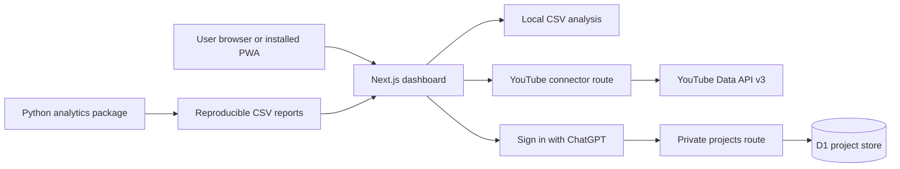

# Architecture

## System overview

## Boundaries

- CSV analysis stays in the browser unless the user explicitly saves a project.
- The YouTube API key exists only in server-side secret storage.
- Public YouTube observations pass through the connector route; the browser never receives the key.
- Saved projects are associated with the signed-in ChatGPT user ID and checked on every read, write, and delete.
- D1 stores structured project JSON. No blob storage is required in v1.0.
- The service worker excludes `/api/` routes from caching.

## Scoring flow

1. Retrieve channel totals and up to 10 recent public videos.
2. Calculate engagement, average-view reach, view consistency, and evidence coverage.
3. Select objective-aware weights for awareness, traffic, or conversions.
4. Produce a 0–100 screening score and Shortlist, Review, or Hold recommendation.
5. Display component scores, weights, confidence, source, refresh time, and limitations.

## Technology decisions

- **Next.js and TypeScript:** typed interactive application and server routes.
- **Cloudflare-compatible runtime:** globally hosted application and managed secrets.
- **D1:** small private project records with server-side ownership checks.
- **YouTube Data API v3:** supported public data access without scraping.
- **Python analytics:** reproducible batch calculations and report generation.
- **Progressive Web App:** one codebase accessible by URL or installed standalone.
