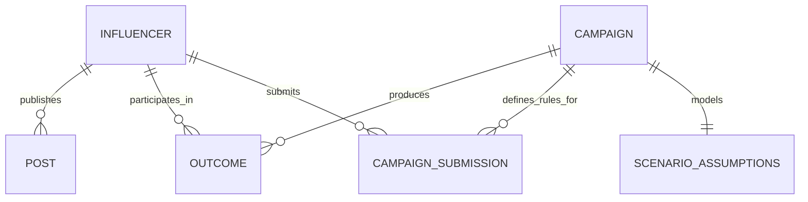

# Data Dictionary

## Design principles

- CSV files contain source-style observations, not AI recommendation scores.
- IDs connect tables without relying on mutable social-media handles.
- Dates use ISO `YYYY-MM-DD` format.
- Currency values use the currency code stored in the same row.
- Percentage fields are stored as percentage points: `3.5` means 3.5%, not 0.035.
- Multi-value text fields use `|` as a separator in the MVP.
- Sample records are entirely synthetic and must not support real-world performance claims.

## Entity relationships

## `campaigns.csv`

| Column | Type | Meaning |
|---|---|---|
| `campaign_id` | string | Stable unique campaign identifier |
| `campaign_name` | string | Human-readable campaign name |
| `objective` | enum | `awareness`, `traffic`, or `conversions` |
| `product_description` | string | Product or service being promoted |
| `target_location` | string | Intended campaign market |
| `target_language` | string | Primary ISO-style language code |
| `target_topics` | pipe-separated text | Desired content concepts |
| `prohibited_terms` | pipe-separated text | Disallowed claims, themes, or competitors |
| `required_hashtags` | pipe-separated text | Hashtags required in sponsored content |
| `required_mentions` | pipe-separated text | Accounts required in sponsored content |
| `required_links` | pipe-separated text | Exact campaign destinations required in content |
| `required_disclosure` | string | Required advertising disclosure text |
| `budget` | decimal | Total campaign budget in `currency` |
| `average_order_value` | decimal | Expected revenue per conversion |
| `start_date` | date | Inclusive planned start date |
| `end_date` | date | Inclusive planned end date |
| `currency` | enum | ISO currency code supported by the MVP |

## `influencers.csv`

| Column | Type | Meaning |
|---|---|---|
| `influencer_id` | string | Stable synthetic creator identifier |
| `handle` | string | Display handle used in the demo |
| `platform` | enum | `instagram`, `youtube`, or `tiktok` |
| `category` | string | Primary content niche |
| `profile_text` | string | Short creator description |
| `location` | string | Self-reported or dataset-provided location |
| `primary_language` | string | Primary content language code |
| `followers` | integer | Current follower/subscriber count |
| `following` | integer | Accounts followed by the creator |
| `average_likes` | decimal | Average likes over the observation window |
| `average_comments` | decimal | Average comments over the observation window |
| `average_views` | decimal | Average views over the observation window |
| `average_shares` | decimal | Average shares over the observation window |
| `follower_growth_30d_pct` | decimal | 30-day follower change in percentage points |
| `engagement_rate_pct` | decimal | Dataset-provided engagement rate for comparison |
| `estimated_fee` | decimal | Estimated campaign participation fee |
| `currency` | enum | Currency for `estimated_fee` |
| `content_topics` | pipe-separated text | Topics associated with creator content |

## `posts.csv`

| Column | Type | Meaning |
|---|---|---|
| `post_id` | string | Unique post identifier |
| `influencer_id` | foreign key | References `influencers.csv` |
| `published_at` | date | Publication date |
| `caption` | string | Caption or post text |
| `likes` | integer | Observed like count |
| `comments` | integer | Observed comment count |
| `views` | integer | Observed view count |
| `shares` | integer | Observed share count |
| `is_sponsored` | boolean | Whether the sample marks the post as sponsored |

## `outcomes.csv`

| Column | Type | Meaning |
|---|---|---|
| `outcome_id` | string | Unique campaign-creator outcome identifier |
| `campaign_id` | foreign key | References `campaigns.csv` |
| `influencer_id` | foreign key | References `influencers.csv` |
| `impressions` | integer | Attributed or tracked campaign impressions |
| `clicks` | integer | Tracked link clicks |
| `conversions` | integer | Tracked conversion events |
| `attributed_revenue` | decimal | Revenue assigned to the campaign record |
| `influencer_fee` | decimal | Creator fee for the campaign |
| `production_cost` | decimal | Additional content-production cost |
| `currency` | enum | Currency shared by revenue and costs |

## `campaign_submissions.csv`

| Column | Type | Meaning |
|---|---|---|
| `submission_id` | string | Unique content-submission identifier |
| `campaign_id` | foreign key | References `campaigns.csv` |
| `influencer_id` | foreign key | References `influencers.csv` |
| `caption` | string | Proposed or submitted campaign caption |

## `scenario_assumptions.csv`

| Column | Type | Meaning |
|---|---|---|
| `campaign_id` | foreign key | One assumption set per sample campaign |
| `audience_size` | integer | Addressable audience used as the funnel starting point |
| `reach_rate_pct` | decimal | Expected share of the audience reached |
| `click_through_rate_pct` | decimal | Expected clicks as a percentage of reach |
| `conversion_rate_pct` | decimal | Expected conversions as a percentage of clicks |
| `average_order_value` | decimal | Expected revenue per conversion |
| `influencer_fees` | decimal | Planned creator fees |
| `production_cost` | decimal | Planned production expenditure |
| `other_campaign_costs` | decimal | Other included campaign expenditure |
| `gross_margin_pct` | decimal | Revenue remaining after direct product/service costs |
| `currency` | enum | Shared currency for values and costs |

## Validation rules

- Required files and columns must exist.
- Primary identifiers must be unique.
- Counts and financial values cannot be negative.
- Engagement rate must stay between 0% and 100%.
- Campaign end date cannot precede its start date.
- Clicks cannot exceed impressions.
- Conversions cannot exceed clicks.
- Post and outcome influencer IDs must exist in `influencers.csv`.
- Outcome campaign IDs must exist in `campaigns.csv`.
- Submission campaign and influencer IDs must reference existing records.
- Scenario rates and gross margin must remain between 0% and 100%.
- Every scenario campaign ID must reference an existing campaign.

These rules verify structural plausibility. They do not prove that uploaded source data is truthful.
